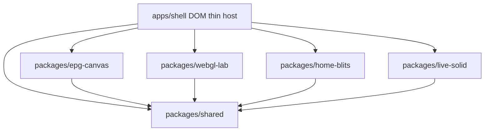
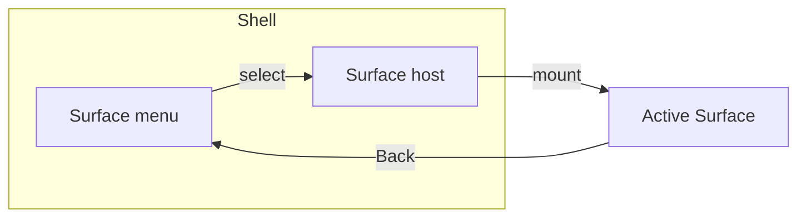

# Architecture Spine — TV Study Shell

## Design Paradigm

**Modular monorepo with multi-renderer surfaces.** One Shell owns navigation, Mock Data loading, and focus key codes. Each Surface owns its renderer runtime and must not import another Surface’s framework runtime.



## Invariants & Rules

### AD-1 — No cross-surface framework imports [ADOPTED]

- **Binds:** all Surface packages
- **Prevents:** Blits code importing Solid, Solid importing Lightning renderer, accidental React
- **Rule:** A Surface package may depend on `packages/shared` only for cross-cutting types/utils; never on another Surface package’s framework entry.

### AD-2 — Thin DOM Shell hosts Surfaces [ADOPTED]

- **Binds:** FR-1, FR-2, FR-3
- **Prevents:** Rewriting Shell in three frameworks; unclear cleanup ownership
- **Rule:** Shell is Vite + TypeScript DOM. Surfaces mount into a host element (or dedicated route root). Shell calls a documented `mount`/`unmount` (or framework equivalent) on Surface enter/leave.

### AD-3 — Mock Data is the only data plane in v1 [ADOPTED]

- **Binds:** FR-4, FR-8, FR-11
- **Prevents:** Ad-hoc fetch sprawl and fake backends
- **Rule:** All channels, programs, and rails come from `packages/shared` fixtures (JSON/TS modules). No production API clients in MVP.

### AD-4 — D-pad key map is shared and stable [ADOPTED]

- **Binds:** FR-2, FR-5, FR-8
- **Prevents:** Divergent key codes per Surface
- **Rule:** ArrowUp/Down/Left/Right, Enter, Backspace/Escape(Back) defined in `packages/shared/input`; Surfaces map to focus moves; Back returns to Shell menu when at Surface root.

### AD-5 — Visible Window virtualization for EPG [ADOPTED]

- **Binds:** FR-4, FR-6
- **Prevents:** DOM/canvas draw of full 50×(24h slots) every frame
- **Rule:** EPG computes Visible Window from scroll/focus; draw only that window; now-line updates without rebuilding the full logical grid model.

### AD-6 — Resource cleanup on Surface leave [ADOPTED]

- **Binds:** FR-2, FR-9, FR-13
- **Prevents:** Texture/listener leaks across navigation
- **Rule:** Every Surface `unmount` must dispose listeners, RAF loops, timers, and textures/images it created. Memory Soak validates this.

### AD-7 — React is forbidden [ADOPTED]

- **Binds:** all
- **Prevents:** JD-misaligned portfolio
- **Rule:** Do not add `react` / `react-dom` dependencies.

### AD-8 — Perf Notes are first-class artifacts [ADOPTED]

- **Binds:** FR-7, FR-10, FR-13, FR-14, FR-16
- **Prevents:** Unmeasured performance claims
- **Rule:** Measurements live under `docs/perf-notes/` with environment labeled; README links them.

### AD-9 — Raw WebGL Lab is a first-class Surface [ADOPTED]

- **Binds:** FR-15, FR-16, FR-17
- **Prevents:** WebGL literacy only via Lightning abstraction; interview gap on GPU vocabulary
- **Rule:** `packages/webgl-lab` owns raw WebGL (context, buffers, textures, programs). Prefer shared Visible Window math from `packages/shared`. Dispose all GPU resources on unmount. Do not replace Blits Home with this package.

### AD-10 — TV-aware test ladder [ADOPTED]

- **Binds:** FR-18, FR-19, FR-20
- **Prevents:** Untested math drift; mouse-only E2E; treating Simulator as a physical TV
- **Rule:** Vitest covers pure shared logic (CI). Playwright Chromium drives D-pad smoke and asserts app-owned focus/outcomes for Canvas/WebGL/Blits (CI). OEM **TV Simulator → TV Emulator** dry-runs are documented on the Dev machine before packaging claims; physical TV remains the honesty gate for memory/DRM. Strategy lives in `docs/testing-strategy.md`.

## Consistency Conventions

| Concern | Convention |
| --- | --- |
| Naming | Packages `epg-canvas`, `webgl-lab`, `home-blits`, `live-solid`, `shared`; Surfaces titled Home / Live / EPG / WebGL Lab in UI |
| Tests | Unit files colocated or under `packages/*/src/**/*.test.ts`; E2E under `tests/e2e` or `apps/shell-e2e` |
| IDs | `channelId`, `programId`, `railId` as string slugs in fixtures |
| Dates/times | ISO-8601 in data; display local formatted in UI |
| Errors | Surface mount failures show Shell-level error banner; no silent blank screens |
| Logging | Prefixed `[epg]` `[home]` `[live]` `[shell]`; no spam in RAF |
| Config | Vite env only for public paths; no secrets |

## Stack

| Name | Version |
| --- | --- |
| TypeScript | 5.x (pin at scaffold) |
| Vite | 6.x or current stable at scaffold |
| pnpm workspaces | preferred [ASSUMPTION: switch to npm workspaces if pnpm unavailable] |
| @lightningjs/blits | current 2.x at scaffold (`npm create @lightningjs/app` lineage) |
| @lightningjs/renderer | Lightning 3 renderer as Blits peer |
| solid-js | 1.x current at scaffold |
| Canvas API | browser CanvasRenderingContext2D |
| WebGL | WebGL1 or WebGL2 (prefer WebGL2 when available; document fallback) |
| Vitest | current at scaffold |
| Playwright | current at scaffold |

## Structural Seed

```text
tv-products/
  apps/
    shell/                 # Vite TS DOM host + routes
  packages/
    shared/                # fixtures, input map, types, perf helpers
    epg-canvas/            # Lab A — Canvas EPG
    webgl-lab/             # Lab W — raw WebGL Visible Window / tiles
    home-blits/            # Lab B (may wrap create@lightningjs/app output)
    live-solid/            # Lab C
  docs/
    perf-notes/            # FR-7, FR-10, FR-13, FR-16, FR-20
    testing-strategy.md
  tests/
    e2e/                   # Playwright D-pad smoke (FR-19)
  README.md                # FR-14
```



## Capability → Architecture Map

| Capability / FR | Lives in | Governed by |
| --- | --- | --- |
| FR-1 Launch Shell | apps/shell | AD-2 |
| FR-2 Switch Surfaces | apps/shell + Surface mount APIs | AD-2, AD-6 |
| FR-3 Safe Zone | apps/shell | conventions |
| FR-4–FR-7 EPG | packages/epg-canvas | AD-5, AD-4, AD-8 |
| FR-15–FR-17 WebGL Lab | packages/webgl-lab | AD-9, AD-4, AD-6, AD-8 |
| FR-8–FR-10 Home | packages/home-blits | AD-1, AD-4, AD-6, AD-8 |
| FR-11–FR-12 Live | packages/live-solid | AD-1, AD-8 |
| FR-13 Soak | docs/perf-notes + manual procedure | AD-6, AD-8 |
| FR-14 README | repo root | AD-8 |
| FR-18 UT | packages/shared + Vitest | AD-10 |
| FR-19 E2E | tests/e2e + Playwright | AD-10 |
| FR-20 Emulator notes | docs/perf-notes | AD-10 |
| Mock Data | packages/shared | AD-3 |

## Deferred

| Decision | Why it can wait |
| --- | --- |
| Exact Blits/Solid patch versions | Pin at scaffold story |
| iframe vs in-page mount for Blits | Spike in Home epic first story |
| Advanced WebGL2 (MRT, lighting) | Beyond textured 2D UI tiles |
| Tizen/webOS packaging + emulator automation in CI | After desktop MVP + FR-20 manual notes |
| Shared design tokens beyond Safe Zone | Visual polish later |
| BackstopJS visual regression | Optional after Blits Home stable |
| Deployment target (Pages vs other) | After README exists |

## Open Questions

- None blocking epics; mount strategy (iframe vs embed) resolved in Home epic spike story.
